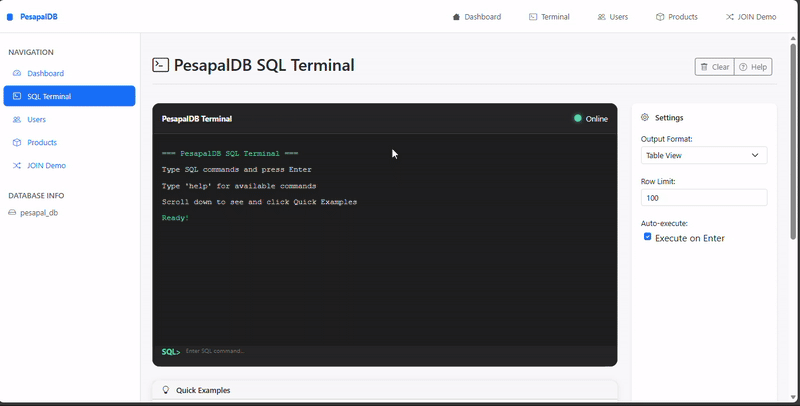
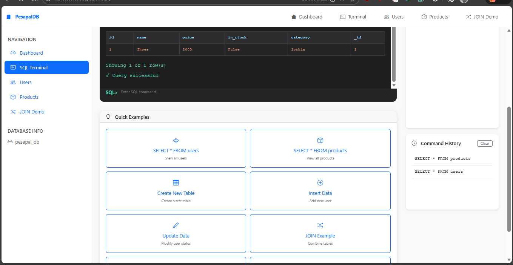
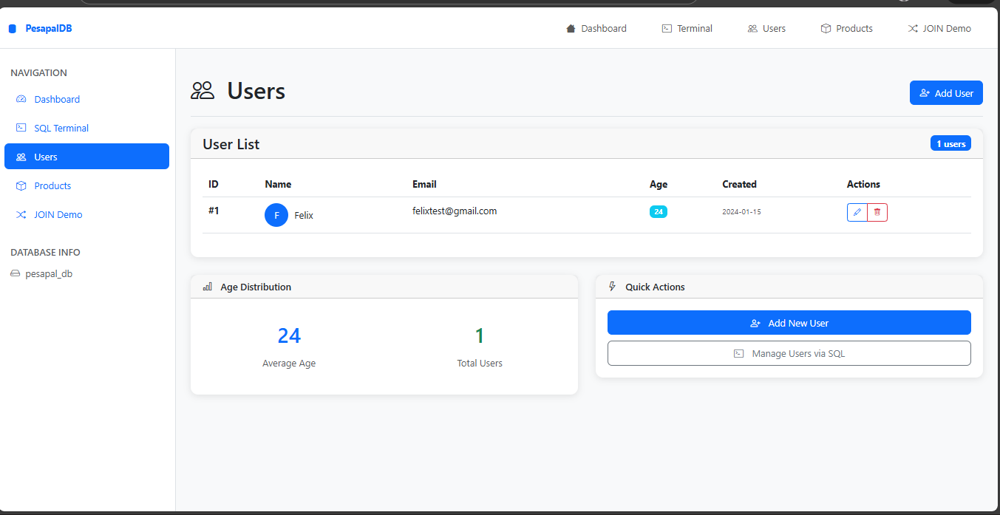
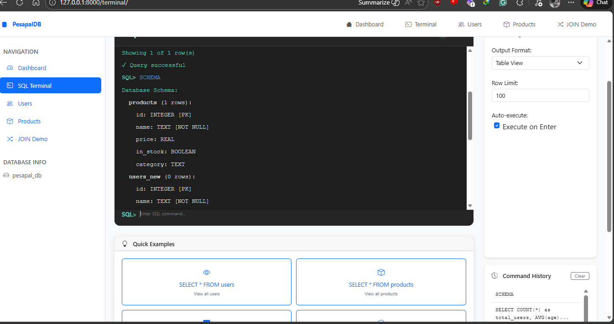
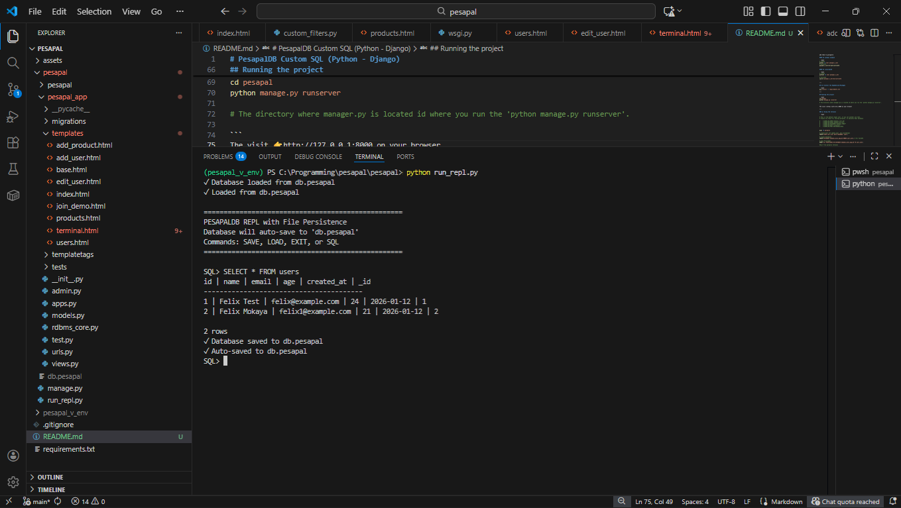

# PesapalDB Custom SQL (Python - Django)


This is a **Simple Custom Relational Database Management System (RDBMS)** written in python where you can store data in a relational database, custom queries. It comes with a web app written using **django** for easier execution. Easy to use with exanples.

> - Main purpose of thes project is to showcase the the custom RDBMS and the web app to access it.

It stores data in file like named **db.pesapal** when you start the app.
---

## ⚡ Tech Stack 
- [Python](https://www.python.org/downloads/) — Main programming language
- [Django](https://www.djangoproject.com/) — Backend web framework
- [Requests](https://docs.python-requests.org/) — API calls from Django (lightly used)
- **HTML5** — Markup structure
- **CSS3** — Styling and layout
- **JavaScript** — Client-side interactivity
- [Bootstrap](https://getbootstrap.com/) — Responsive UI components

---

## 📦 Installation & Setup
---
### 1️⃣ Clone the repository
```bash
git clone https://github.com/felixmokayabeatz/pesapal.git
cd pesapal
# Default Brach (main)
```

---

## 2️⃣ Create and Acticvate the virtual environment (I will move to docker sooner to make setup easier)

> - For uniformity and easier colloboration use the exact names of the virtual environment names below. If you create with another name add them to gitignore

#### On windows example

```bash
# Create
python -m venv pesapal_v_env
# Activate
pesapal_v_env\Scripts\activate
```

#### On Linux/macOS

```bash
# Create
python3 -m venv pesapal_v_env

# Activate
source pesapal_v_env/bin/activate
```

---

## 3️⃣ Install the Depedencies/Packages

```bash
pip install -r requirements.txt
```
---

## Running the project

```bash
cd pesapal
python manage.py runserver

# The directory where manager.py is located id where you run the 'python manage.py runserver'.

```
The visit 👉http://127.0.0.1:8000 on your browser

---

## You can also use a normal terminal to access the RDBMS (Optional just works exactly like the web version)

 > Make sure you are on the root of the project where [run_repl.py](./pesapal/run_repl.py) and run it using the following command.

```bash
    python run_repl.py
```

# Demo gif and screenshots

## 🎥 Demo gif



## Screenshots







## Thank You ✌️